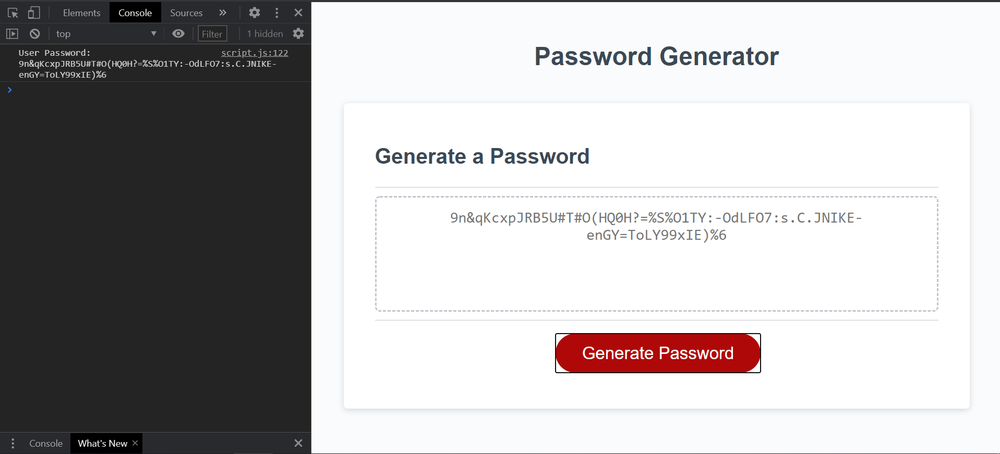

# Password Generator

This project is meant to generate a random password based on user input or criteria.

The user will enter a numeric value between 8 and 128 in the prompt that occurse after the user has clicked the 'Generate Password Button'.

The user will answer a series of 4 'yes or no' questions to determine the criteria of the new password.

The Program will assemble an array with random characters concatcted, that are matching the user's criteria.

The Program will display the new random password to the user.

## Links

* [GitHub Repo HTTPS](https://github.com/kjmckinley/password.git)
* [GitHub Repo SSH](git@github.com:kjmckinley/password.git)
* [Deployed Link](https://kjmckinley.github.io/password/)

## User Story

```
AS AN employee with access to sensitive data
I WANT to randomly generate a password that meets certain criteria
SO THAT I can create a strong password that provides greater security
```

## Criteria

```
GIVEN I need a new, secure password
WHEN I click the button to generate a password
THEN I am presented with a series of prompts for password criteria
WHEN prompted for password criteria
THEN I select which criteria to include in the password
WHEN prompted for the length of the password
THEN I choose a length of at least 8 characters and no more than 128 characters
WHEN prompted for character types to include in the password
THEN I choose lowercase, uppercase, numeric, and/or special characters
WHEN I answer each prompt
THEN my input should be validated and at least one character type should be selected
WHEN all prompts are answered
THEN a password is generated that matches the selected criteria
WHEN the password is generated
THEN the password is either displayed in an alert or written to the page
```

The image below is an example of the web app's functionality:



